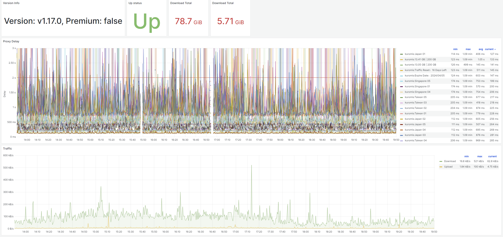

# Clash Exporter for Prometheus

[](https://hub.docker.com/r/elonzh/clash_exporter)
[](https://github.com/elonzh/clash_exporter/releases)
[](https://github.com/elonzh/clash_exporter/actions)
[](https://codecov.io/gh/elonzh/clash_exporter)
[](https://github.com/elonzh/clash_exporter/blob/main/LICENSE)

This is a simple server that scrapes [Clash](https://github.com/Dreamacro/clash) stats and exports them via HTTP for
Prometheus consumption.

There is a [`dashboard.json`](dashboard.json) file that can be imported into Grafana to provide a sample dashboard.

### Sample dashboard



### Sample Metrics

```
# HELP clash_connection_download_total Number of bytes that downloaded by clash.
# TYPE clash_connection_download_total counter
clash_connection_download_total 111
# HELP clash_connection_upload_total Number of bytes that uploaded by clash.
# TYPE clash_connection_upload_total counter
clash_connection_upload_total 222
# HELP clash_exporter_scrapes_total Current total Clash scrapes.
# TYPE clash_exporter_scrapes_total counter
clash_exporter_scrapes_total 1
# HELP clash_proxy_delay Proxy delay.
# TYPE clash_proxy_delay gauge
clash_proxy_delay{name="provider_1_proxy_Http",provider="provider_1",type="Http"} 4
clash_proxy_delay{name="provider_1_proxy_Shadowsocks",provider="provider_1",type="Shadowsocks"} 65535
clash_proxy_delay{name="provider_1_proxy_ShadowsocksR",provider="provider_1",type="ShadowsocksR"} 1
clash_proxy_delay{name="provider_1_proxy_Snell",provider="provider_1",type="Snell"} 2
clash_proxy_delay{name="provider_1_proxy_Socks5",provider="provider_1",type="Socks5"} 3
clash_proxy_delay{name="provider_1_proxy_Trojan",provider="provider_1",type="Trojan"} 6
clash_proxy_delay{name="provider_1_proxy_Vmess",provider="provider_1",type="Vmess"} 5
# HELP clash_up Was the last scrape of Clash successful.
# TYPE clash_up gauge
clash_up 1
# HELP clash_version_info Clash version info.
# TYPE clash_version_info gauge
clash_version_info{premium="true",version="2021.04.08"} 1
```


## Getting Started

To run it:

```bash
./clash_exporter [flags]
```

Help on flags:

```bash
./clash_exporter --help
```

For more information check the [source code documentation][gdocs].

[gdocs]: https://pkg.go.dev/github.com/elonzh/clash_exporter

### TLS and basic authentication

The Clash Exporter supports TLS and basic authentication.

To use TLS and/or basic authentication, you need to pass a configuration file
using the `--web.config.file` parameter. The format of the file is described
[in the exporter-toolkit repository](https://github.com/prometheus/exporter-toolkit/blob/master/docs/web-configuration.md).

## Development

### Building

```bash
make build
```

### Testing

```bash
make test
```
